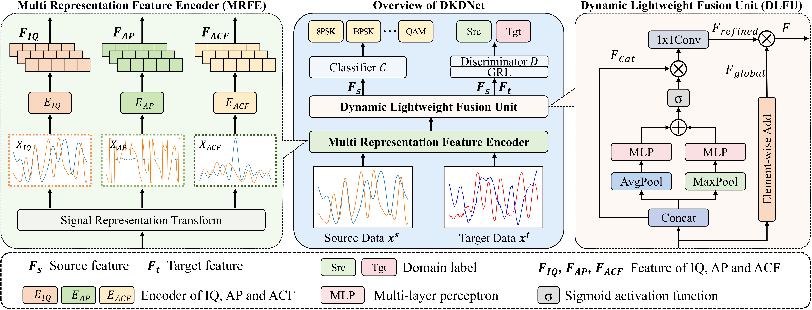
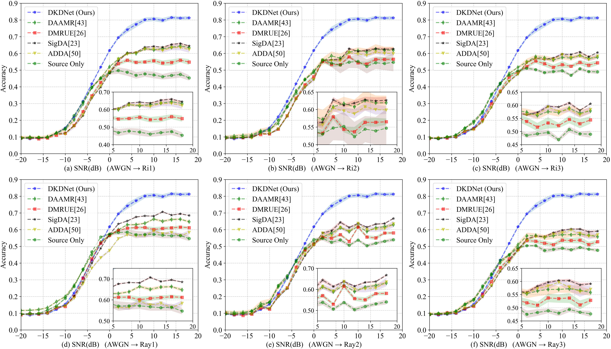

# DKDNet

Official repository for the paper:
[**DKDNet: Dual Knowledge and Data-Driven Network for Cross-Domain Automatic Modulation Classification**](https://arxiv.org/abs/2607.08031)

Code is being prepared and will be released soon.

## Overview

Automatic modulation classification (AMC) is an important technique for intelligent spectrum sensing and radio-environment perception. However, deep learning-based AMC models often suffer from performance degradation when deployed under unseen channel or hardware conditions, due to distribution shifts between the training and deployment domains.

DKDNet is a dual knowledge and data-driven framework for cross-domain AMC. It introduces modulation-related signal priors into unsupervised domain adaptation (UDA) by using multiple signal representations as structured inputs. Instead of relying only on data-driven feature alignment, DKDNet combines prior-guided representation learning with adversarial domain alignment to improve target-domain generalization.

## Pipeline

  

  Overview of the proposed DKDNet framework.

The overall pipeline consists of four main stages:

1. **Signal prior construction**  
   The received signals from the source and target domains are transformed into multiple signal representations, including in-phase/quadrature (IQ), amplitude-phase (AP), and autocorrelation function (ACF).

2. **Multi-representation feature extraction**  
   A Multi-Representation Feature Encoder (MRFE) processes different representations with independent branches and maps them into a unified feature space.

3. **Adaptive feature fusion**  
   A Dynamic Lightweight Fusion Unit (DLFU) adaptively integrates complementary information from different signal priors to obtain a compact fused representation.

4. **Cross-domain optimization**  
   The fused source features are optimized with the modulation classification objective, while both source and target features are aligned through adversarial domain adaptation.

## Method

### Signal-prior-guided representation learning

Different signal representations encode different modulation-related priors. In DKDNet, three compact and complementary representations are selected:

- **IQ representation** preserves the raw complex waveform and provides fundamental modulation information.
- **AP representation** explicitly describes amplitude and phase evolution.
- **ACF representation** captures second-order temporal dependency and statistical periodicity.

These representations provide complementary views of the received signal and help the model learn features that are both discriminative and transferable across domains.

### Multi-Representation Feature Encoder

The Multi-Representation Feature Encoder (MRFE) extracts representation-specific features from IQ, AP, and ACF inputs. Each representation is processed by an independent branch, which helps preserve its own signal characteristics before feature fusion.

### Dynamic Lightweight Fusion Unit

The Dynamic Lightweight Fusion Unit (DLFU) is designed to adaptively fuse the extracted features. It combines global complementary information with lightweight adaptive feature refinement, allowing DKDNet to emphasize informative signal priors under different domain conditions.

### Domain-adversarial learning

DKDNet follows the unsupervised domain adaptation setting, where labeled source-domain samples and unlabeled target-domain samples are available during training. The fused features are optimized by:

- a source-domain modulation classification loss;
- a domain-adversarial alignment loss.

Through joint optimization, DKDNet learns feature representations that are discriminative for modulation classification and transferable across domains.

## Experimental Results

### Comparison with UDA baselines

  

  Target-domain accuracy under six AWGN-source adaptation settings.

The figure compares DKDNet with representative UDA-based AMC methods under six cross-domain adaptation settings, including AWGN→Ri1, AWGN→Ri2, AWGN→Ri3, AWGN→Ray1, AWGN→Ray2, and AWGN→Ray3.

Across all target domains, DKDNet consistently achieves the best performance, especially in the medium- and high-SNR ranges. When the SNR is above approximately -4 dB, DKDNet shows a clear advantage over DAAMR, DMRUE, SigDA, ADDA, and the Source Only baseline. This indicates that the proposed signal-prior-guided representation learning can provide more transferable features than purely data-driven feature alignment.

At very low SNRs, all methods obtain relatively low accuracy because severe noise corruption obscures modulation-discriminative structures. As the SNR increases, the performance gap between DKDNet and the compared methods becomes more evident. DKDNet reaches around 0.8 accuracy in several target domains, while the baselines generally saturate at a lower level.

The results demonstrate that DKDNet improves cross-domain AMC performance under both Rician and Rayleigh fading scenarios. The consistent gains across different target domains also suggest that the selected IQ, AP, and ACF priors provide complementary and relatively stable information for domain-adaptive modulation classification.

## Datasets

The experiments in the paper are conducted on the constructed **RML2025 Series** datasets and the public **RML22** benchmark.

- **RML2025 Series**: [FireTracer/RML2025-Series](https://github.com/FireTracer/RML2025-Series)
- **RML22**: [venkateshsathya/RML22](https://github.com/venkateshsathya/RML22)

This repository focuses on the implementation of DKDNet. Please refer to the corresponding dataset repositories for data download, generation scripts, and preparation instructions.

## Status

- [x] Paper completed
- [ ] Code release
- [ ] Pretrained models
- [ ] Detailed reproduction instructions
